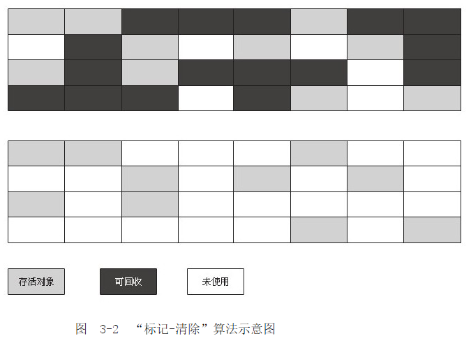
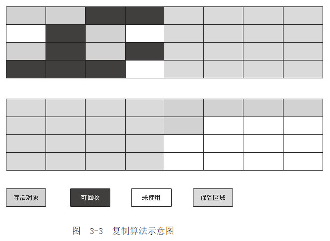
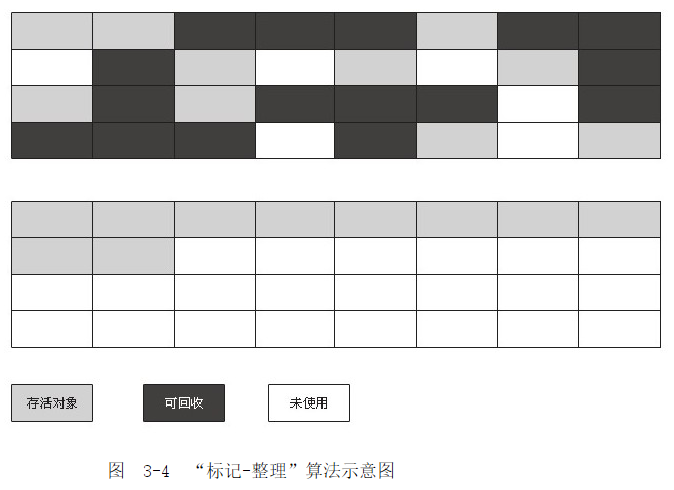

<!-- TOC -->

- [垃圾收集器与内存分配策略](#垃圾收集器与内存分配策略)
    - [概述](#概述)
    - [对象已死吗](#对象已死吗)
        - [引用计数法](#引用计数法)
        - [可达性分析算法](#可达性分析算法)
        - [再谈引用](#再谈引用)
        - [生存还是死亡](#生存还是死亡)
        - [回收方法区](#回收方法区)
    - [垃圾收集算法](#垃圾收集算法)
        - [标记——清除算法](#标记清除算法)
        - [复制算法](#复制算法)
        - [标记-整理算法](#标记-整理算法)
        - [分代收集算法](#分代收集算法)
    - [垃圾收集器](#垃圾收集器)
        - [Serial 收集器](#serial-收集器)
        - [ParNew收集器](#parnew收集器)
        - [Parallel Scavenge收集器](#parallel-scavenge收集器)
        - [Serial Old 收集器](#serial-old-收集器)
        - [Parallel Old 收集器](#parallel-old-收集器)
        - [CMS 收集器](#cms-收集器)
        - [G1收集器](#g1收集器)
    - [内存分配与回收策略](#内存分配与回收策略)
        - [对象优先在Eden区分配](#对象优先在eden区分配)
        - [大对象直接进入老年代](#大对象直接进入老年代)
        - [长期存活的对象将进入老年代](#长期存活的对象将进入老年代)
        - [动态对象年龄判定](#动态对象年龄判定)

<!-- /TOC -->

# 垃圾收集器与内存分配策略

## 概述

* 哪些垃圾需要回收？
* 什么时候回收？
* 如何回收？

当需要排查各种 内存溢出问题、当垃圾收集称为系统达到更高并发的瓶颈时，就需要对这些“自动化”的技术实施必要的监控和调节。

## 对象已死吗

堆中几乎放着所有的对象实例，对堆垃圾回收前的第一步就是要判断那些对象已经死亡（即不能再被任何途径使用的对象）

### 引用计数法

给对象中添加一个引用计数器，每当有一个地方引用它，计数器就加1；当引用失效，计数器就减1；任何时候计数器为0的对象就是不可能再被使用的。

这个方法实现简单，效率高，但是目前主流的虚拟机中并没有选择这个算法来管理内存，其最主要的原因是它很难解决对象之间相互循环引用的问题。

### 可达性分析算法

这个算法的基本思想就是通过一系列的称为 **“GC Roots”** 的对象作为起点，从这些节点开始向下搜索，节点所走过的路径称为引用链，当一个对象到GC Roots没有任何引用链相连的话，则证明此对象是不可用的。

### 再谈引用

JDK1.2以后，Java对引用的感念进行了扩充，将引用分为强引用、软引用、弱引用、虚引用四种（引用强度逐渐减弱）

1. **强引用** 

以前我们使用的大部分引用实际上都是强引用，这是使用最普遍的引用。如果一个对象具有强引用，那就类似于 **必不可少** 的生活用品，垃圾回收器绝不会回收它。当内存空间不足，Java 虚拟机宁愿抛出 `OutOfMemoryError` 错误，使程序异常终止，也不会靠随意回收具有强引用的对象来解决内存不足问题。

2. **软引用（SoftReference）** 

如果一个对象只具有软引用，那就类似于 **可有可无** 的生活用品。如果内存空间足够，垃圾回收器就不会回收它，如果内存空间不足了，就会回收这些对象的内存。只要垃圾回收器没有回收它，该对象就可以被程序使用。软引用可用来实现内存敏感的高速缓存。

软引用可以和一个引用队列（`ReferenceQueue`）联合使用，如果软引用所引用的对象被垃圾回收，JAVA 虚拟机就会把这个软引用加入到与之关联的引用队列中。

3. **弱引用（WeakReference）** 

如果一个对象只具有弱引用，那就类似于 **可有可无** 的生活用品。弱引用与软引用的区别在于：只具有弱引用的对象拥有更短暂的生命周期。在垃圾回收器线程扫描它 所管辖的内存区域的过程中，一旦发现了只具有弱引用的对象，不管当前内存空间足够与否，都会回收它的内存。不过，由于垃圾回收器是一个优先级很低的线程， 因此不一定会很快发现那些只具有弱引用的对象。

弱引用可以和一个引用队列（`ReferenceQueue`）联合使用，如果弱引用所引用的对象被垃圾回收，Java虚拟机就会把这个弱引用加入到与之关联的引用队列中。

4. **虚引用（PhantomReference）** 

"虚引用"顾名思义，就是形同虚设，与其他几种引用都不同，虚引用并不会决定对象的生命周期。如果一个对象仅持有虚引用，那么它就和没有任何引用一样，在任何时候都可能被垃圾回收。

**虚引用主要用来跟踪对象被垃圾回收的活动**。

虚引用与软引用和弱引用的一个 **区别** 在于： 虚引用必须和引用队列（`ReferenceQueue`）联合使用。当垃 圾回收器准备回收一个对象时，如果发现它还有虚引用，就会在回收对象的内存之前，把这个虚引用加入到与之关联的引用队列中。程序可以通过判断引用队列中是 否已经加入了虚引用，来了解被引用的对象是否将要被垃圾回收。程序如果发现某个虚引用已经被加入到引用队列，那么就可以在所引用的对象的内存被回收之前采取必要的行动。

特别注意，在程序设计中一般很少使用弱引用与虚引用，使用软引用的情况较多，这是因为 **软引用可以加速 JVM 对垃圾内存的回收速度，可以维护系统的运行安全，防止内存溢出（`OutOfMemory`）等问题的产生**。

### 生存还是死亡

即使在可达性分析法中不可达的对象，也并非是“非死不可”的，这时候它们暂时处于“缓刑阶段”，要真正宣告一个对象死亡，至少要经历两次标记过程；可达性分析法中不可达的对象被第一次标记并且进行一次筛选，筛选的条件是此对象是否有必要执行 `finalize` 方法。当对象没有覆盖 `finalize` 方法，或 `finalize` 方法已经被虚拟机调用过时，虚拟机将这两种情况视为没有必要执行。被判定为需要执行的对象将会被放在一个队列中进行第二次标记，除非这个对象与引用链上的任何一个对象建立关联，否则就会被真的回收。

### 回收方法区

方法区（或 Hotspot 虚拟中的永久代）的垃圾收集主要回收两部分内容：**废弃常量** 和 **无用的类**。

判定一个常量是否是“废弃常量”比较简单，而要判定一个类是否是“无用的类”的条件则相对苛刻许多。类需要同时满足下面3个条件才能算是 **“无用的类”** ：

* 该类所有的实例都已经被回收，也就是 Java 堆中不存在该类的任何实例。
* 加载该类的 `ClassLoader` 已经被回收。
* 该类对应的 `java.lang.Class` 对象没有在任何地方被引用，无法在任何地方通过反射访问该类的方法。

## 垃圾收集算法

### 标记——清除算法

算法分为“标记”和“清除”阶段：首先标记出所有需要回收的对象，在标记完成后统一回收所有被标记的对象。它是最基础的收集算法，会带来两个明显的问题：
1. 效率问题和
2. 空间问题（标记清除后会产生大量不连续的碎片）

### 复制算法

为了解决效率问题，“复制”收集算法出现了。它可以将内存分为大小相同的两块，每次使用其中的一块。当这一块的内存使用完后，就将还存活的对象复制到另一块去，然后再把使用的空间一次清理掉。这样就使每次的内存回收都是对内存区间的一半进行回收。 

### 标记-整理算法

根据老年代的特点特出的一种标记算法，标记过程仍然与“标记-清除”算法一样，但后续步骤不是直接对可回收对象回收，而是让所有存活的对象向一段移动，然后直接清理掉端边界以外的内存。

### 分代收集算法

当前虚拟机的垃圾收集都采用分代收集算法，这种算法没有什么新的思想，只是根据对象存活周期的不同将内存分为几块。一般将java堆分为新生代和老年代，这样我们就可以根据各个年代的特点选择合适的垃圾收集算法。

比如在新生代中，每次收集都会有大量对象死去，所以可以选择复制算法，只需要付出少量对象的复制成本就可以完成每次垃圾收集。而老年代的对象存活几率是比较高的所以我们可以选择“标记-清理”或“标记-整理”算法进行垃圾收集。

## 垃圾收集器

### Serial 收集器

Serial（串行）收集器收集器是最基本、历史最悠久的垃圾收集器了。大家看名字就知道这个收集器是一个单线程收集器了。它的 “**单线程**” 的意义不仅仅意味着它只会使用一条垃圾收集线程去完成垃圾收集工作，更重要的是它在进行垃圾收集工作的时候必须暂停其他所有的工作线程（**Stop The World**），直到它收集结束。

虚拟机的设计者们当然知道 **Stop The World** 带来的不良用户体验，所以在后续的垃圾收集器设计中停顿时间在不断缩短（仍然还有停顿，寻找最优秀的垃圾收集器的过程仍然在继续）。

但是 Serial 收集器有没有优于其他垃圾收集器的地方呢？当然有，它 **简单而高效**（与其他收集器的单线程相比）。Serial 收集器由于没有线程交互的开销，自然可以获得很高的单线程收集效率。Serial 收集器对于运行在 Client 模式下的虚拟机来说是个不错的选择。

### ParNew收集器

ParNew收集器其实就是Serial收集器的多线程版本，除了使用多线程进行垃圾收集外，其余行为（控制参数、收集算法、回收策略等等）和Serial收集器完全一样。

它是许多运行在 Serve r模式下的虚拟机的首要选择，除了 Serial 收集器外，只有它能与 CMS 收集器（真正意义上的并发收集器，后面会介绍到）配合工作。

**并行与并发**

* 并行（Parallel）：指多条垃圾收集线程并行工作，但此时用户线程仍然处于等待状态。
* 并发（Concurrent）：指用户线程与垃圾收集线程同时执行（但不一定是并行，可能会交替执行），用户程序在继续运行，而垃圾收集器运行在另一个CPU上。

### Parallel Scavenge收集器

Parallel Scavenge 收集器是一个新生代收集器，它也是使用复制算法的收集器，又是并行的的多线程收集器。

**Parallel Scavenge收集器关注点是吞吐量（高效率的利用CPU）。CMS等垃圾收集器的关注点更多的是用户线程的停顿时间（提高用户体验）。所谓吞吐量就是CPU中用于运行用户代码的时间与CPU总消耗时间的比值**。 Parallel Scavenge 收集器提供了很多参数供用户找到最合适的停顿时间或最大吞吐量，如果对于收集器运作不太了解的话，手工优化存在的话可以选择把内存管理优化交给虚拟机去完成也是一个不错的选择。

### Serial Old 收集器

**Serial 集器的老年代版本**，它同样是一个单线程收集器。它主要有两大用途：一种用途是在JDK1.5以及以前的版本中与Parallel Scavenge收集器搭配使用，另一种用途是作为CMS收集器的后备方案。

### Parallel Old 收集器

**Parallel Scavenge 收集器的老年代版本**。使用多线程和“标记-整理”算法。在注重吞吐量以及CPU资源的场合，都可以优先考虑 Parallel Scavenge收集器和Parallel Old收集器。

### CMS 收集器

CMS（Concurrent Mark Sweep）收集器是一种以获取最短回收停顿时间为目标的收集器。它而非常符合在注重用户体验的应用上使用。

从名字中的 Mark Sweep 这两个词可以看出，CMS 收集器是一种 “标记-清除”算法实现的，它的运作过程相比于前面几种垃圾收集器来说更加复杂一些。整个过程分为四个步骤：

* **初始标记**： 暂停所有的其他线程，并记录下直接与root相连的对象，速度很快 ；
* **并发标记**： 同时开启GC和用户线程，用一个闭包结构去记录可达对象。但在这个阶段结束，这个闭包结构并不能保证包含当前所有的可达对象。因为用户线程可能会不断的更新引用域，所以GC线程无法保证可达性分析的实时性。所以这个算法里会跟踪记录这些发生引用更新的地方。
* **重新标记**： 重新标记阶段就是为了修正并发标记期间因为用户程序继续运行而导致标记产生变动的那一部分对象的标记记录，这个阶段的停顿时间一般会比初始标记阶段的时间稍长，远远比并发标记阶段时间短
* **并发清除**： 开启用户线程，同时GC线程开始对为标记的区域做清扫。

主要优点：**并发收集**、**低停顿**。但是它有下面三个明显的缺点：

* 对CPU资源敏感；
* 无法处理浮动垃圾；
* 它使用的回收算法-“标记-清除”算法会导致收集结束时会有大量空间碎片产生。

### G1收集器

上一代的垃圾收集器(串行serial, 并行parallel, 以及CMS)都把堆内存划分为固定大小的三个部分: 年轻代(young generation), 年老代(old generation), 以及持久代(permanent generation)。

G1 (Garbage-First)是一款面向服务器的垃圾收集器,主要针对配备多颗处理器及大容量内存的机器. 以极高概率满足GC停顿时间要求的同时,还具备高吞吐量性能特征。

* **并行与并发**：G1能充分利用CPU、多核环境下的硬件优势，使用多个CPU（CPU或者CPU核心）来缩短stop-The-World停顿时间。部分其他收集器原本需要停顿Java线程执行的GC动作，G1收集器仍然可以通过并发的方式让java程序继续执行。
* **分代收集**：虽然G1可以不需要其他收集器配合就能独立管理整个GC堆，但是还是保留了分代的概念。
* **空间整合**：与CMS的“标记--清理”算法不同，G1从整体来看是基于“标记整理”算法实现的收集器；从局部上来看是基于“复制”算法实现的。
* **可预测的停顿**：这是G1相对于CMS的另一个大优势，降低停顿时间是G1和ＣＭＳ共同的关注点，但Ｇ１除了追求低停顿外，还能建立可预测的停顿时间模型，能让使用者明确指定在一个长度为M毫秒的时间片段内。

G1收集器在后台维护了一个优先列表，每次根据允许的收集时间，优先选择回收价值最大的Region(这也就是它的名字Garbage-First的由来)。这种使用Region划分内存空间以及有优先级的区域回收方式，保证了GF收集器在有限时间内可以尽可能高的收集效率（把内存化整为零）。

G1收集器的运作大致分为以下几个步骤：

* 初始标记
* 并发标记
* 最终标记
* 筛选回收

上面几个步骤的运作过程和CMS有很多相似之处。初始标记阶段仅仅只是标记一下GC Roots能直接关联到的对象，并且修改TAMS的值，让下一个阶段用户程序并发运行时，能在正确可用的Region中创建新对象，这一阶段需要停顿线程，但是耗时很短，并发标记阶段是从GC Root开始对堆中对象进行可达性分析，找出存活的对象，这阶段时耗时较长，但可与用户程序并发执行。而最终标记阶段则是为了修正在并发标记期间因用户程序继续运作而导致标记产生变动的那一部分标记记录，虚拟机将这段时间对象变化记录在线程Remenbered Set Logs里面，最终标记阶段需要把Remembered Set Logs的数据合并到Remembered Set Logs里面，最终标记阶段需要把Remembered Set Logs的数据合并到Remembered Set中，这一阶段需要停顿线程，但是可并行执行。最后在筛选回收阶段首先对各个Region的回收价值和成本进行排序，根据用户所期望的GC停顿时间来制定回收计划。

## 内存分配与回收策略

### 对象优先在Eden区分配

大多数情况下，对象在新生代中Eden区分配。当Eden区没有足够空间进行分配时，虚拟机将发起一次Minor GC.

* **新生代GC（Minor GC）**:指发生新生代的的垃圾收集动作，Minor GC非常频繁，回收速度一般也比较快。
* **老年代GC（Major GC/Full GC）**:指发生在老年代的GC，出现了Major GC经常会伴随至少一次的Minor GC（并非绝对），Major GC的速度一般会比Minor GC的慢10倍以上。

### 大对象直接进入老年代

大对象就是需要大量连续内存空间的对象（比如：字符串、数组）。

### 长期存活的对象将进入老年代

既然虚拟机采用了分代收集的思想来管理内存，那么内存回收时就必须能识别那些对象应放在新生代，那些对象应放在老年代中。为了做到这一点，虚拟机给每个对象一个对象年龄（Age）计数器。

### 动态对象年龄判定

为了更好的适应不同程序的内存情况，虚拟机不是永远要求对象年龄必须达到了某个值才能进入老年代，如果Survivor 空间中相同年龄所有对象大小的总和大于Survivor空间的一半，年龄大于或等于该年龄的对象就可以直接进入老年代，无需达到要求的年龄。