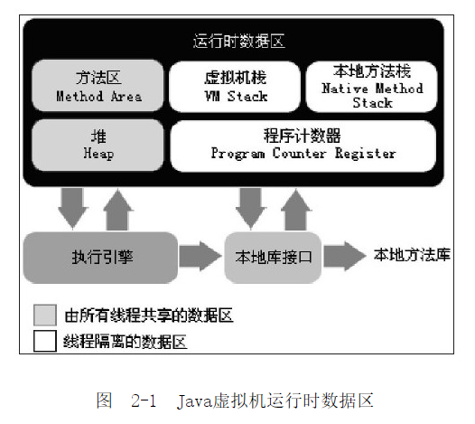
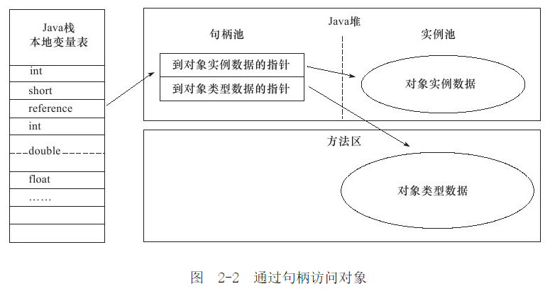

<!-- TOC -->

- [Java 内存区域与内存溢出异常](#java-内存区域与内存溢出异常)
    - [概述](#概述)
    - [运行时数据区域](#运行时数据区域)
        - [程序计数器](#程序计数器)
        - [Java 虚拟机栈](#java-虚拟机栈)
        - [本地方法栈](#本地方法栈)
        - [堆](#堆)
        - [方法区](#方法区)
        - [运行时常量池](#运行时常量池)
        - [直接内存](#直接内存)
    - [HotSpot 虚拟机对象探秘](#hotspot-虚拟机对象探秘)
        - [对象的创建](#对象的创建)
        - [对象的内存布局](#对象的内存布局)
        - [对象的访问定位](#对象的访问定位)

<!-- /TOC -->

# Java 内存区域与内存溢出异常

## 概述

对于 Java 程序员来说，在虚拟机自动内存管理机制下，不再需要像 C/C++ 程序开发程序员这样为内一个 `new` 操作去写对应的 `delete`/`free` 操作，不容易出现内存泄漏和内存溢出问题。正是因为 Java 程序员把内存控制权利交给 Java 虚拟机，一旦出现内存泄漏和溢出方面的问题，如果不了解虚拟机是怎样使用内存的，那么排查错误将会是一个非常艰巨的任务。

## 运行时数据区域

Java 虚拟机在执行 Java 程序的过程中会把它管理的内存划分成若干个不同的数据区域。

### 程序计数器

程序计数器是一块较小的内存空间，可以看作是当前线程所执行的字节码的行号指示器。字节码解释器工作时通过改变这个计数器的值来选取下一条需要执行的字节码指令，分支、循环、跳转、异常处理、线程恢复等功能都需要依赖这个计数器来完。

另外，为了线程切换后能恢复到正确的执行位置，每条线程都需要有一个独立的程序计数器，各线程之间计数器互不影响，独立存储，我们称这类内存区域为“线程私有”的内存。

### Java 虚拟机栈

与程序计数器一样，Java 虚拟机栈也是线程私有的，它的生命周期和线程相同，描述的是 Java 方法执行的内存模型。

Java 内存可以粗糙的区分为 **堆内存**（Heap）和 **栈内存**（Stack）,其中栈就是现在说的虚拟机栈，或者说是虚拟机栈中局部变量表部分。

局部变量表主要存放了编译器可知的各种数据类型、对象引用。

### 本地方法栈

和虚拟机栈所发挥的作用非常相似，区别是： **虚拟机栈为虚拟机执行 Java 方法 （也就是字节码）服务，而本地方法栈则为虚拟机使用到的 Native 方法服务**。

### 堆

Java 虚拟机所管理的内存中最大的一块，Java 堆是所有线程共享的一块内存区域，在虚拟机启动时创建。 **此内存区域的唯一目的就是存放对象实例，几乎所有的对象实例以及数组都在这里分配内存**。Java 堆是垃圾收集器管理的主要区域，因此也被称作 **GC 堆（Garbage Collected Heap）**。从垃圾回收的角度，由于现在收集器基本都采用分代垃圾收集算法，所以Java堆还可以细分为：新生代和老年代：在细致一点有：Eden空间、From Survivor、To Survivor空间等。**进一步划分的目的是更好地回收内存，或者更快地分配内存**。

### 方法区

**方法区与Java堆一样，是各个线程共享的内存区域，它用于存储已被虚拟机加载的类信息、常量、静态变量、即使编译器编译后的代码等数据**。

HotSpot虚拟机中方法区也常被称为 **“永久代”**，本质上两者并不等价。仅仅是因为HotSpot虚拟机设计团队用永久代来实现方法区而已，这样HotSpot虚拟机的垃圾收集器就可以像管理Java堆一样管理这部分内存了。但是这并不是一个好主意，因为这样更容易遇到内存溢出问题。

相对而言，垃圾收集行为在这个区域是比较出现的，但并非数据进入方法区后就“永久存在”了。

### 运行时常量池

运行时常量池是方法区的一部分。Class文件中除了有类的版本、字段、方法、接口等描述信息外，还有常量池信息（用于存放编译期生成的各种字面量和符号引用）

### 直接内存

直接内存并不是虚拟机运行时数据区的一部分，也不是虚拟机规范中定义的内存区域，但是这部分内存也被频繁地使用。而且也可能导致 `OutOfMemoryError` 异常出现。

JDK1.4中新加入的 **NIO(New Input/Output)** 类，引入了一种基于通道（`Channel`） 与缓存区（`Buffer`） 的 I/O 方式，它可以直接使用 Native 函数库直接分配堆外内存，然后通过一个存储在 Java 堆中的 `DirectByteBuffer` 对象作为这块内存的引用进行操作。这样就能在一些场景中显著提高性能，因为 **避免了在 Java 堆和 Native 堆之间来回复制数据**。

本机直接内存的分配不会收到Java堆的限制，但是，既然是内存就会受到本机总内存大小以及处理器寻址空间的限制。

## HotSpot 虚拟机对象探秘

通过上面的介绍我们大概知道了虚拟机的内存情况，下面我们来详细的了解一下 HotSpot 虚拟机在 Java 堆中对象分配、布局和访问的全过程。

### 对象的创建

虚拟机遇到一条new指令时，首先将去检查这个指令的参数是否能在常量池中定位到这个类的符号引用，并且检查这个符号引用代表的类是否已被加载过、解析和初始化过。如果没有，那必须先执行相应的类加载过程。

在 **类加载检查** 通过后，接下来虚拟机将为新生对象 **分配内存**。对象所需的内存大小在类加载完成后便可确定，为对象分配空间的任务等同于把一块确定大小的内存从Java堆中划分出来。分配方式有 **“指针碰撞”** 和 **“空闲列表”** 两种，**选择那种分配方式由Java堆是否规整决定，而Java堆是否规整又由所采用的垃圾收集器是否带有压缩整理功能决定**。

**虚拟机采用 CAS 配上失败重试的方式保证更新操作的原子性**。

接下来，虚拟机要对对象进行必要的设置，例如这个对象是那个类的实例、如何才能找到类的元数据信息、对象的哈希吗、对象的 GC 分代年龄等信息。这些信息存放在对象头中，根据虚拟机当前运行状态的不同，如是否启用偏向锁等，对象头会与不同的设置方式。
`new` 指令执行完后，再按照程序员的意愿执行 `init` 方法后一个真正可用的对象才诞生。

### 对象的内存布局

在 Hotspot 虚拟机中，对象在内存中的布局可以分为3快区域：**对象头**、**实例数据** 和 **对齐填充**。

**Hotspot 虚拟机的对象头包括两部分信息，第一部分用于存储对象自身的自身运行时数据**（哈希吗、GC分代年龄、锁状态标志等等），**另一部分是类型指针**，即对象指向它的类元数据的指针，虚拟机通过这个指针来确定这个对象是那个类的实例。

**实例数据部分是对象真正存储的有效信息**，也是在程序中所定义的各种类型的字段内容。

**对齐填充部分不是必然存在的，也没有什么特别的含义，仅仅起占位作用**。 因为 Hotspot 虚拟机的自动内存管理系统要求对象起始地址必须是8字节的整数倍，换句话说就是对象的大小必须是8字节的整数倍。而对象头部分正好是8字节的倍数（1倍或2倍），因此，当对象实例数据部分没有对齐时，就需要通过对齐填充来补全。

### 对象的访问定位

建立对象就是为了使用对象，我们的 Java 程序通过栈上的 reference 数据来操作堆上的具体对象。对象的访问方式有虚拟机实现而定，目前主流的访问方式有 **使用句柄** 和 **直接指针** 两种。

1. 如果使用句柄的话，那么 Java 堆中将会划分出一块内存来作为句柄池，reference 中存储的就是对象的句柄地址，而句柄中包含了对象实例数据与类型数据各自的具体地址信息；

2. 如果使用直接指针访问，那么 Java 堆对像的布局中就必须考虑如何防止访问类型数据的相关信息，reference 中存储的直接就是对象的地址。

> 这两种对象访问方式各有优势。使用句柄来访问的最大好处是reference中存储的是稳定的句柄地址，在对象被移动时只会改变句柄中的实例数据指针，而reference本身不需要修改。使用直接指针访问方式最大的好处就是速度快，它节省了一次指针定位的时间开销。