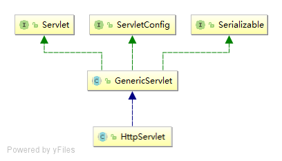

# Servlet

## `Servlet` 结构示意图



## `Servlet` 接口

```java
public interface Servlet {

    public void init(ServletConfig config) throws ServletException;
    
    public ServletConfig getServletConfig();
    
    public void service(ServletRequest req, ServletResponse res) throws ServletException, IOException;

    public String getServletInfo();
    
    public void destroy();
}
```

* `init` 方法在容器启动时被容器调用，只会调用一次；
    * `<load-on-startup>` 标记容器启动是否在启动的时候就加载这个 `Servlet`；
    * 当是一个负数时或者没有指定时，则指示容器在该 `Servlet` 被选择时才加载；
    * 当值为0或者大于0时，表示容器在应用启动时就加载这个 `Servlet`；
    * 正数的值越小，启动该 `Servlet` 的优先级越高。
* `getServletConfig` 用于获取 `ServletConfig`；
* `service` 具体处理一个请求；
* `getServletInfo` 返回 `Servlet` 一些信息，如作者、版权等，需要自己实现，一般返回空字符串；
* `destroy` 主要用于 `Servlet` 销毁（一般指关闭服务器）时释放一些资源，也只会调用一次。

```xml
<servlet>
    <servlet-name>spring</servlet-name>
    <servlet-class>org.springframework.web.servlet.DispatcherServlet</servlet-class>
    <init-param>
        <param-name>contextConfigLocation</param-name>
        <param-value>classpath*:spring-*.xml</param-value>
    </init-param>
    <load-on-startup>1</load-on-startup>
</servlet>
```

`init` 方法被调用时会接收到一个 `ServletConfig` 类型的参数，是容器传入的。`ServletConfig` 是 `Servlet` 的配置，在 `web.xml` 中定义 `Servlet` 时，通过 `<init-param>` 配置的参数就是通过 `ServletConfig` 保存的。

Tomcat 中 `Servlet` 的 `init` 方法实在 `org.apache.catalina.core.StandardWrapper` 中的 `initServlet` 方法中调用， `ServletConfig` 传入的是 `StandardWrapper`（里面封装着 `Servlet` ）自身的门面类 `StandardWrapperFacade`。`StandardWrapper` 本身就包含配置项，然而 `StandardWrapper` 并不是所有内容都是和 `Config` 相关的，所有用其门面类。

```java
public interface ServletConfig {
    
    public String getServletName();

    public ServletContext getServletContext();

    public String getInitParameter(String name);

    public Enumeration<String> getInitParameterNames();
}
```

* `getServletName` 用于获取 `Servlet` 名称，也就是定义的 `<servlet-name>`；
* `getInitParameter` 用于获取 `<init-param>` 中配置参数；
* `getInitParameterNames` 用于获取 `<init-param>` 的名字集合；
* `getServletContext` 返回值 `ServletContext` 代表应用本身；`ServletContext` 其实就是 Tomcat 中 `Context` 的门面类 `ApplicationContextFacade` （具体代码参考 `StandardContext` 的 `getServletContext` 方法）。

> `ServletContext` 里边设置的参数可以被当前应用的所有 `Servlet` 共享，在项目中参数可以保存在 `Session` 中，也可以保存在 `Application` 中，后者保存在 `ServletContext` 中。

## `GenericServlet`

`GenericServlet` 是 `Servlet` 的默认实现，主要做了三件事：
1. 实现 `ServletConfig` 接口，可以直接调用 `ServletConfig` 里面的方法；
2. 提供无参的 `init` 方法；
3. 提供 `log` 方法。

> `GenericServlet` 与具体协议无关

## `HttpServlet`


