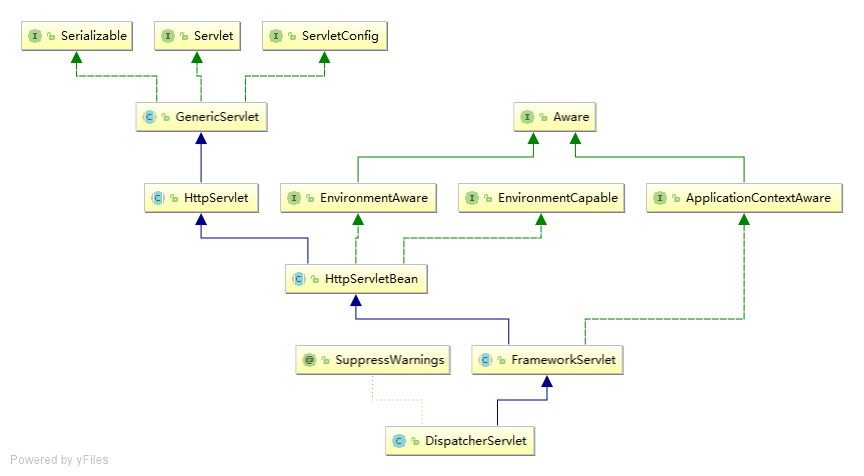

# Spring MVC

## 一、`Context` 结构


## 二、配置方式

### 2.1 `web.xml` 配置方式

```xml
<web-app>

    <listener>
        <listener-class>org.springframework.web.context.ContextLoaderListener</listener-class>
    </listener>

    <context-param>
        <param-name>contextConfigLocation</param-name>
        <param-value>/WEB-INF/app-context.xml</param-value>
    </context-param>

    <servlet>
        <servlet-name>app</servlet-name>
        <servlet-class>org.springframework.web.servlet.DispatcherServlet</servlet-class>
        <init-param>
            <param-name>contextConfigLocation</param-name>
            <param-value></param-value>
        </init-param>
        <load-on-startup>1</load-on-startup>
    </servlet>

    <servlet-mapping>
        <servlet-name>app</servlet-name>
        <url-pattern>/app/*</url-pattern>
    </servlet-mapping>

</web-app>
```

### 2.2 Java 配置方式

```java
public class MyWebAppInitializer extends AbstractAnnotationConfigDispatcherServletInitializer {

    @Override
    protected Class<?>[] getRootConfigClasses() {
        return new Class<?>[] { RootConfig.class };
    }

    @Override
    protected Class<?>[] getServletConfigClasses() {
        return new Class<?>[] { AppConfig.class };
    }

    @Override
    protected String[] getServletMappings() {
        return new String[] { "/app/*" };
    }
}
```

**配置剖析**

在 **Servlet 3.0** 环境中： 

1. 容器会首先查找实现 `javax.servlet.ServletContainerInitializer` 接口的类，如果发现会用来配置 `Servlet` 容器；
2. Srping 提供这个接口的实现，为 `SpringServletContainerInitializer` ，这个类反过来会查找实现 `WebApplicationInitializer` 的类，并将配置的任务交给他们来完成；


3. Spring 3.2 中，提供了 `WebApplicationInitializer` 实现基础，也就是`AbstractAnnotationConfigDispatcherServletInitializer` 。


## 三、Spring MVC 自身创建过程 

### 3.1 整体结构



* `EnvironmentAware`
* `ApplicationContextAware`
* `EnvironmentCapable`

`XXXAware` 在 Spring 中表示对 `XXXX` 的感知。也就是如果某个类需要使用 Spring 中的一些东西，可以通过实现 `XXXAware` 接口告诉 Spring，使用接口中的 `setXXX` 方法进行接收。例，实现 `ApplicationContextAware` 接口，通过 `void setApplicationContext(ApplicationContext applicationContext)` 获取 `ApplicationContext`。

`EnvironmentCapable` 用于提供 `Environment`，当 Spring 需要 `Environment` 时就调用其 `Environment getEnvironment()` 方法。

### 3.2 `HttpServletBean`

`Servlet` 创建时可以直接调用无参数的 `init` 方法

```java
// org.springframework.web.servlet.HttpServletBean

@Override
public final void init() throws ServletException {
    if (logger.isDebugEnabled()) {
        logger.debug("Initializing servlet '" + getServletName() + "'");
    }

    // Set bean properties from init parameters.
    PropertyValues pvs = new ServletConfigPropertyValues(getServletConfig(), this.requiredProperties);
    if (!pvs.isEmpty()) {
        try {
            BeanWrapper bw = PropertyAccessorFactory.forBeanPropertyAccess(this);
            ResourceLoader resourceLoader = new ServletContextResourceLoader(getServletContext());
            bw.registerCustomEditor(Resource.class, new ResourceEditor(resourceLoader, getEnvironment()));
            initBeanWrapper(bw);
            bw.setPropertyValues(pvs, true);
        }
        catch (BeansException ex) {
            if (logger.isErrorEnabled()) {
                logger.error("Failed to set bean properties on servlet '" + getServletName() + "'", ex);
            }
            throw ex;
        }
    }

    // Let subclasses do whatever initialization they like.
    initServletBean();

    if (logger.isDebugEnabled()) {
        logger.debug("Servlet '" + getServletName() + "' configured successfully");
    }
}
```

