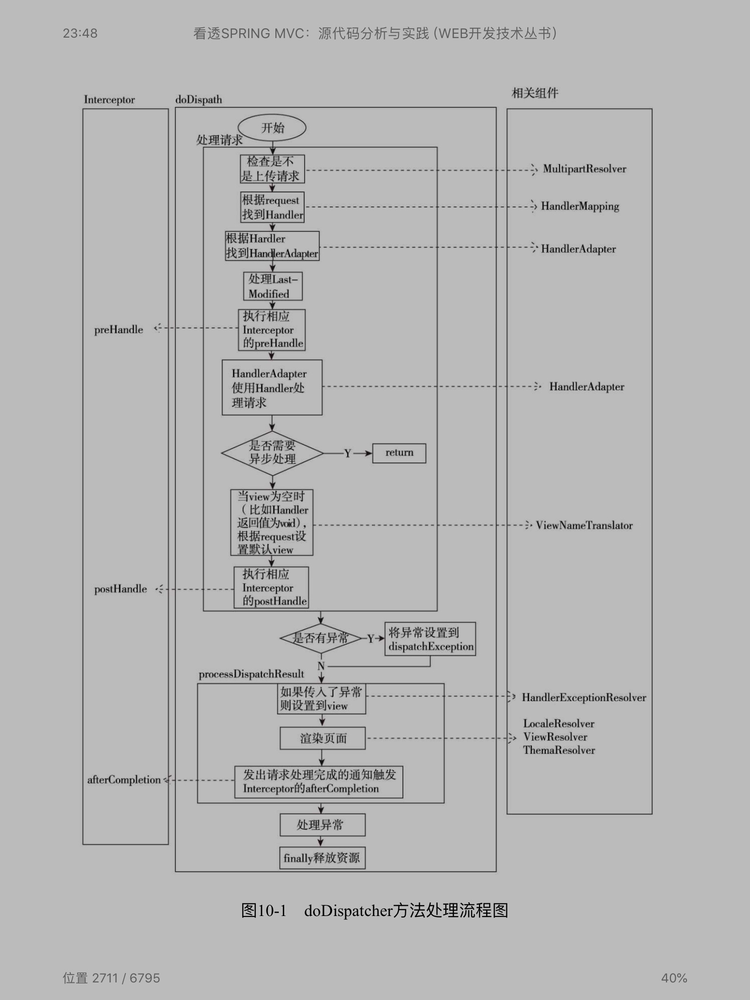

# Spring MVC 处理请求过程

## `HttpServletBean` 

`HttpServletBean` 主要参与了创建工作，并没有涉及请求的处理。

## `FrameworkServlet`

在 `HttpServlet` 的 `service` 方法中根据请求的类型不同将请求路由到了 `doGet`、`doHead`、`doPost`、`doPut`、`doDelete`、`doOptions` 和 `doTrace` 七个方法，并且做了 `doHead`、`doOptions` 和 `doTrace` 的默认实现，其中 `doHead` 调用 `doGet`，然后返回只有 `header` 没有 `body` 的 `response`。

在 `FrameworkServlet` 中重写了 `service`、`doGet`、`doPost`、`doPut`、`doDelete`、`doOptions`、`doTrace` 方法（除了 `doHead` 的所有处理请求的方法。方法）。在 `service` 方法中增加了对 `PATCH` 类型请求的处理，其他类型的请求直接交给了父类进行处理；`doOptions` 和 `doTrace` 方法可以通过设置 `dispatchOptionsRequest` 和 `dispatchTraceRequest` 参数决定是自己处理还是交给父类处理（默认都是交给父类处理，`doOptions` 会在父类的处理结果中增加 `PATCH` 类型）。

以 `GET` 请求为例

```
get request -> FrameworkServlet(service) -> 判断是不是 patch 请求：不是 -> HttpServlet(service) -> 判断是什么类型：get -> HttpServlet(doGet)-> doGet 被子类重写 -> FrameworkServlet(doGet) -> FrameworkServlet(processRequest)
```

在 `FrameworkServlet` 中会统一调用  `processRequest` 方法处理各种请求。

```java
protected final void processRequest(HttpServletRequest request, HttpServletResponse response)
		throws ServletException, IOException {

	long startTime = System.currentTimeMillis();
	Throwable failureCause = null;

    // 获取 LocaleContextHolder 中原来保存的 LocaleContext
    LocaleContext previousLocaleContext = LocaleContextHolder.getLocaleContext();
    // 获取当前请求的 LocaleContext
	LocaleContext localeContext = buildLocaleContext(request);

    // 获取 RequestContextHolder 中原来保存的 RequestAttributes
    RequestAttributes previousAttributes = RequestContextHolder.getRequestAttributes();
    // 获取当前请求的 ServletRequestAttributes
	ServletRequestAttributes requestAttributes = buildRequestAttributes(request, response, previousAttributes);

	WebAsyncManager asyncManager = WebAsyncUtils.getAsyncManager(request);
	asyncManager.registerCallableInterceptor(FrameworkServlet.class.getName(), new RequestBindingInterceptor());

    // 将当前请求的 LocaleContext 和 ServletRequestAttributes 设置到 LocaleContextHolder 和 RequestContextHolder
	initContextHolders(request, localeContext, requestAttributes);

	try {
        // 实际入口
		doService(request, response);
	}
	catch (ServletException | IOException ex) {
		failureCause = ex;
		throw ex;
	}
	catch (Throwable ex) {
		failureCause = ex;
		throw new NestedServletException("Request processing failed", ex);
	}

	finally {
        // 恢复原来的 LocaleContext 和 ServletRequestAttributes 到 LocaleContextHolder 和 RequestContextHolder 中
		resetContextHolders(request, previousLocaleContext, previousAttributes);
		if (requestAttributes != null) {
			requestAttributes.requestCompleted();
		}

		// 省略日志代码

        //发布 ServletRequestHandledEvent 消息
		publishRequestHandledEvent(request, response, startTime, failureCause);
	}
}
```

`doService` 是一个模板方法，具体在 `DispatcherServlet` 中实现。

`processRequest` 主要做两件事：
1. 对 `LocaleContext` 和 `RequestAttributes` 的设置及恢复；
2. 处理完后发布了 `ServletRequestHandledEvent` 消息。

`LocaleContext` 包含本地化信息 `Locale`。

`RequestAttributes` 是 Spring 的一个接口，通过它可以 `get/set/removeAttribute`，根据 `SCOPE_REQUEST/SCOPE_SESSION` 参数判断操作 `request` 还是 `session`，这里使用的是 `ServletRequestAttributes`。

`LocaleContextHolder` 是一个 `abstract` 类，里面方法都是  `static` 的，可以直接调用，而且既没有父类也没有子类，也就是不能实例化，只能调用定义的 `static` 方法。**也是一种 `abstract` 使用方式**。

```java
public abstract class LocaleContextHolder {

	private static final ThreadLocal<LocaleContext> localeContextHolder =
			new NamedThreadLocal<>("LocaleContext");

	private static final ThreadLocal<LocaleContext> inheritableLocaleContextHolder =
			new NamedInheritableThreadLocal<>("LocaleContext");

    ...
}
```

`publishRequestHandledEvent` 用于发布消息，在其内部发布了一个 `ServletRequestHandledEvent` 消息。

```java
private void publishRequestHandledEvent(HttpServletRequest request, HttpServletResponse response,
		long startTime, @Nullable Throwable failureCause) {

    // publishEvents 可以在配置 Servlet 时设置，默认为 true
	if (this.publishEvents && this.webApplicationContext != null) {
		// 无论请求是否执行都会发布消息
		long processingTime = System.currentTimeMillis() - startTime;
		this.webApplicationContext.publishEvent(
				new ServletRequestHandledEvent(this,
						request.getRequestURI(), request.getRemoteAddr(),
						request.getMethod(), getServletConfig().getServletName(),
						WebUtils.getSessionId(request), getUsernameForRequest(request),
						processingTime, failureCause, response.getStatus()));
	}
}
```

可以通过监听这个事件来处理一些事情，如记录日志

```java
@Component 
public class ServletRequestHandledEventListener implements ApplicationListener<ServletRequestHandledEvent> { 

    final static Logger logger = LoggerFactory.getLogger("RequestProcessLog"); 

    @Override 
    public void onApplicationEvent(ServletRequestHandledEvent event) { 
        logger.info(event.getDescription()); 
    } 
}
```

## `DispatcherServlet`

```java
@Override
protected void doService(HttpServletRequest request, HttpServletResponse response) throwsException {
    
    // 省略日志代码

	// Keep a snapshot of the request attributes in case of an include,
    // to be able to restore the original attributes after the include.
    // 当 include 请求时对 request attributes 做个快照
    // 处理完之后会对其还原
	Map<String, Object> attributesSnapshot = null;
	if (WebUtils.isIncludeRequest(request)) {
		attributesSnapshot = new HashMap<>();
		Enumeration<?> attrNames = request.getAttributeNames();
		while (attrNames.hasMoreElements()) {
			String attrName = (String) attrNames.nextElement();
			if (this.cleanupAfterInclude || attrName.startsWith(DEFAULT_STRATEGIES_PREFIX)) {
				attributesSnapshot.put(attrName, request.getAttribute(attrName));
			}
		}
	}

	// Make framework objects available to handlers and view objects.
	request.setAttribute(WEB_APPLICATION_CONTEXT_ATTRIBUTE, getWebApplicationContext());
	request.setAttribute(LOCALE_RESOLVER_ATTRIBUTE, this.localeResolver);
	request.setAttribute(THEME_RESOLVER_ATTRIBUTE, this.themeResolver);
	request.setAttribute(THEME_SOURCE_ATTRIBUTE, getThemeSource());

	if (this.flashMapManager != null) {
		FlashMap inputFlashMap = this.flashMapManager.retrieveAndUpdate(request, response);
		if (inputFlashMap != null) {
			request.setAttribute(INPUT_FLASH_MAP_ATTRIBUTE, Collections.unmodifiableMa(inputFlashMap));
		}
		request.setAttribute(OUTPUT_FLASH_MAP_ATTRIBUTE, new FlashMap());
		request.setAttribute(FLASH_MAP_MANAGER_ATTRIBUTE, this.flashMapManager);
	}

	try {
		doDispatch(request, response);
	}
	finally {
		if (!WebAsyncUtils.getAsyncManager(request).isConcurrentHandlingStarted()) {
			// Restore the original attribute snapshot, in case of an include.
			if (attributesSnapshot != null) {
				restoreAttributesAfterInclude(request, attributesSnapshot);
			}
		}
	}
}
```

对 `request` 设置属性时，有4个属性 `WebApplicationContext`、`LocaleResolver`、`ThemeResolver`和`ThemeSource`。后面三个属性都和 `FlashMap` 相关，主要用于 redirect 转发时参数的传递。在 redirect 之前将需要传递的参数写入 `OUTPUT_FLASH_MAP_ATTRIBUTE`。

```java
((FlashMap)((ServletRequestAttributes)(RequestContextHolder.getRequestAttributes()))
    .getRequest()
    .getAttribute(DispatcherServlet.OUTPUT_FLASH_MAP_ATTRIBUTE))
        .put("name", "张三 丰");
```

Spring 还提供了更加简单的操作方法，在 handler 方法的参数中定义 `RedirectAttributes` 类型变量，然后把需要保存的属性设置到里面就行。`RedirectAttributes` 有两种设置参数的方法 `addAttribute(key,value)` 和 `addFlashAttribute(key,value)` ，第一种方式会拼接到 url 中，第二种就是使用 `FlashMap` 保存的。

`inputFlashMap` 用于保存上次请求中转发过来的属性，`outputFlashMap` 用于保存请求需要转发的属性，`FlashManager` 用于管理它们。

## `doDispatch`

`doDispatch` 核心代码只有4句：
1. 根据 `request` 找到 `Handler`；
2. 根据 `Handler` 找到 `HandlerAdapter`；
3. 用 `HandlerAdapter` 处理 `Handler`；
4. 调用 `processDispatchResult` 方法处理上面处理之后的结果。

```java
mappedHandler = getHandler(processedRequest);
HandlerAdapter ha = getHandlerAdapter(mappedHandler.getHandler());
mv = ha.handle(processedRequest, response, mappedHandler.getHandler());
processDispatchResult(processedRequest, response, mappedHandler, mv, dispatchException);
```

* `Handler` <br>
代表处理器，对应 `Controller` 层，它的具体表现形式有很多，可以是类，也可以是方法。例如，标注了 `@RequestMapping` 的所有方法都可以看成一个 `Handler`。只要可以实际处理请求就可以是`Handler`。

* `HandlerMapping` <br>
用来查找 `Handler`

* `HandlerAdapter` <br>
是一个适配器，使用 `Handler` 去处理请求

```java
protected void doDispatch(HttpServletRequest request, HttpServletResponse response) throws Exception {
    HttpServletRequest processedRequest = request;
    HandlerExecutionChain mappedHandler = null;
    boolean multipartRequestParsed = false;

    WebAsyncManager asyncManager = WebAsyncUtils.getAsyncManager(request);

    try {
        ModelAndView mv = null;
        Exception dispatchException = null;

        try {
            // 检查是不是上传请求
            processedRequest = checkMultipart(request);
            multipartRequestParsed = (processedRequest != request);

            // 根据 request 找到对应的 handler
            mappedHandler = getHandler(processedRequest);
            if (mappedHandler == null) {
                noHandlerFound(processedRequest, response);
                return;
            }

            // 根据 handler 找到对应的 handler adapter
            HandlerAdapter ha = getHandlerAdapter(mappedHandler.getHandler());

            // Process last-modified header, if supported by the handler.
            String method = request.getMethod();
            boolean isGet = "GET".equals(method);
            if (isGet || "HEAD".equals(method)) {
                long lastModified = ha.getLastModified(request, mappedHandler.getHandler());
                
                // 省略日志代码

                if (new ServletWebRequest(request, response).checkNotModified(lastModified) && isGet) {
                    return;
                }
            }

            // 执行相应 Interceptor 的 PreHandle
            if (!mappedHandler.applyPreHandle(processedRequest, response)) {
                return;
            }

            // 实际执行的 handler.
            mv = ha.handle(processedRequest, response, mappedHandler.getHandler());

            // 如果需要异步处理，直接返回
            if (asyncManager.isConcurrentHandlingStarted()) {
                return;
            }

            // 当 view 为空时，根据 request 设置默认 view
            applyDefaultViewName(processedRequest, mv);

            // 执行相应 Interceptor 的 PostHandle
            mappedHandler.applyPostHandle(processedRequest, response, mv);
        }
        catch (Exception ex) {
            dispatchException = ex;
        }
        catch (Throwable err) {
            // As of 4.3, we're processing Errors thrown from handler methods as well,
            // making them available for @ExceptionHandler methods and other scenarios.
            dispatchException = new NestedServletException("Handler dispatch failed", err);
        }
        processDispatchResult(processedRequest, response, mappedHandler, mv, dispatchException);
    }
    catch (Exception ex) {
        triggerAfterCompletion(processedRequest, response, mappedHandler, ex);
    }
    catch (Throwable err) {
        triggerAfterCompletion(processedRequest, response, mappedHandler,
                new NestedServletException("Handler processing failed", err));
    }
    finally {
        // 判断是否异步执行请求
        if (asyncManager.isConcurrentHandlingStarted()) {
            // Instead of postHandle and afterCompletion
            if (mappedHandler != null) {
                mappedHandler.applyAfterConcurrentHandlingStarted(processedRequest, response);
            }
        }
        else {
            // Clean up any resources used by a multipart request.
            if (multipartRequestParsed) {
                cleanupMultipart(processedRequest);
            }
        }
    }
}
```

`HttpServletRequest processedRequest` - 实际处理时所用的 `request` ，如果不是上传请求直接使用，是上传请求封装为上传类型的 `request`。

`HandlerExecutionChain mappedHandler` - 处理请求的处理链（包含处理器和对应的 `Interceptor`）。

`boolean multipartRequestParsed` - 是不是上传请求标识。

`ModelAndView mv` - 封装 `Model` 和 `View` 的容器。

`Exception dispatchException` - 处理请求过程中抛出的异常。



