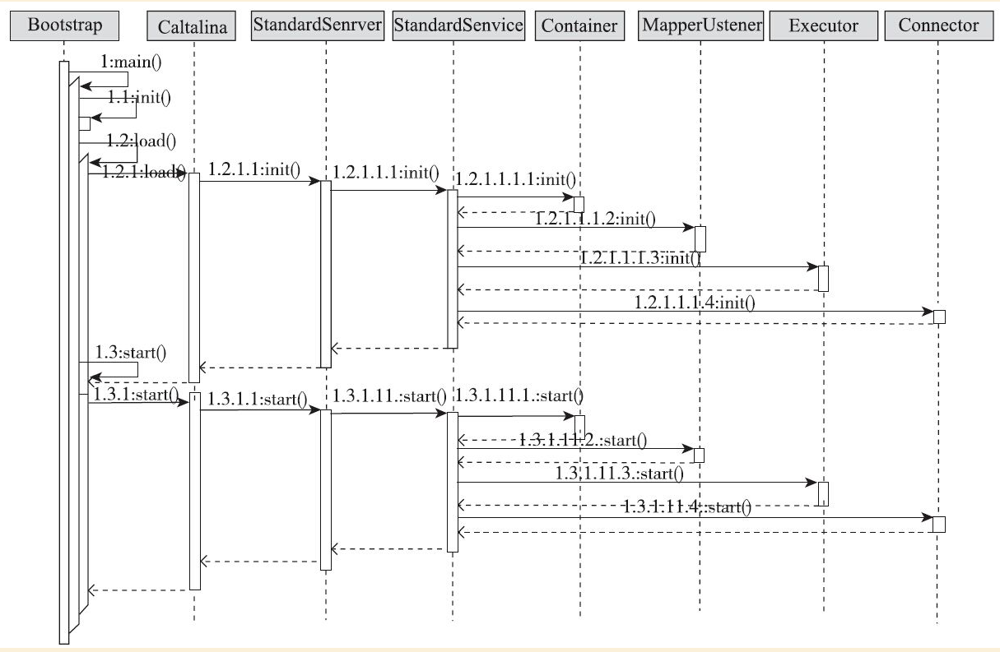

# Tomcat

## Tomcat 的顶层结构及启动过程

## Tomcat 的顶层结构

Tomcat 中最顶层的容器叫Server， 代表整个服务器， Server 中包含至少一个 Service， 用于具体提供服务。

Service 主要包含两部分： Connector 和 Container
* Connector 用于处理连接相关的事情，并提供 Socket 与 request、 response 的转换；
* Container 用于封装和管理 Servlet，以及具体处理 request 请求。 

一个 Tomcat 中只有一个 Server， 一个 Server 可以包含多个 Service， 一个 Service 只有一个 Container，但可以有多个 Connectors

Tomcat 里的 Server 由 `org.apache.catalina.startup.Catalina` 来管理，`Catalina` 是整个 Tomcat 的管理类， 它里面的三个方法 `load`、 `start`、 `stop` 分别用来管理整个服务器的生命周期。

* `load` 方法用于根据 `conf/server.xml` 文件创建 Server 并调用 Server 的 `init` 方法进行初始化；
* `start` 方法用于启动服务器；
* `stop` 方法用于停止服务器；

`start` 和 `stop` 方法在内部分别调用了 Server 的 `start` 和 `stop` 方法， `load` 方法内部调用了 Server 的 `init` 方法，这三个方法都会按容器的结构逐层调用相应的方法，`Catalina` 还有个方法也很重要，那就是 `await` 方法，`Catalina` 中的 `await` 方法直接调用了 Server 的 `await` 方法，这个方法的作用是进入一个循环，让主线程不会退出。

Tomcat 的入口 `main` 方法在 `org. pache.catalina.startup.Bootstrap` 中。 `Bootstrap` 的作用类似一个 `CatalinaAdaptor`， 具体处理过程还是使用`Catalina` 来完成的， 这么做的好处是可以把启动的入口和具体的管理类分开，从而可以很方便地创建出多种启动方式，每种启动方式只需要写一个相应的 `CatalinaAdaptor`就可以了。

## `Bootstrap` 启动过程

`Bootstrap` 是 Tomcat 的入口，正常情况下启动 Tomcat 就是调用 `Bootstrap` 的 `main` 方法。

```java
public static void main(String args[]) {

    synchronized (daemonLock) {
        if (daemon == null) {
            // Don't set daemon until init() has completed
            Bootstrap bootstrap = new Bootstrap();
            try {
                // 初始化 ClassLoader，并用 ClassLoader 创建了 Catalina 实例，赋值给 catalinaDaemon
                bootstrap.init();
            } catch (Throwable t) {
                handleThrowable(t);
                t.printStackTrace();
                return;
            }
            daemon = bootstrap;
        } else {
            // When running as a service the call to stop will be on a new
            // thread so make sure the correct class loader is used to
            // prevent a range of class not found exceptions.
            Thread.currentThread().setContextClassLoader(daemon.catalinaLoader);
        }
    }

    try {
        String command = "start";
        if (args.length > 0) {
            command = args[args.length - 1];
        }

        if (command.equals("startd")) {
            args[args.length - 1] = "start";
            daemon.load(args);
            daemon.start();
        } else if (command.equals("stopd")) {
            args[args.length - 1] = "stop";
            daemon.stop();
        } else if (command.equals("start")) {
            daemon.setAwait(true);
            daemon.load(args);
            daemon.start();
        } else if (command.equals("stop")) {
            daemon.stopServer(args);
        } else if (command.equals("configtest")) {
            daemon.load(args);
            if (null==daemon.getServer()) {
                System.exit(1);
            }
            System.exit(0);
        } else {
            log.warn("Bootstrap: command \"" + command + "\" does not exist.");
        }
    } catch (Throwable t) {
        // Unwrap the Exception for clearer error reporting
        if (t instanceof InvocationTargetException &&
                t.getCause() != null) {
            t = t.getCause();
        }
        handleThrowable(t);
        t.printStackTrace();
        System.exit(1);
    }

}
```

首先新建了 `Bootstrap`，并执行 `init` 方法初始化；然后处理 `main` 方法传入的命令，如果 `args` 参数为空，默认执行 `start`。在 `init` 方法里初始化了 `ClassLoader`，并用 `ClassLoader` 创建了 `Catalina` 实例，然后赋给 `catalinaDaemon` 变量，后面对命令的操作都要使用 `catalinaDaemon` 来具体执行。

```java
public void start() throws Exception {
    if( catalinaDaemon==null ) init();

    Method method = catalinaDaemon.getClass().getMethod("start", (Class [] )null);
    method.invoke(catalinaDaemon, (Object [])null);
}
```

## `Catalina` 启动过程

`Catalina` 的启动主要是调用 `setAwait` 、`load` 和 `start` 方法来完成。`setAwait` 方法用于设置 Server 启动完成后是否进入等待状态的标志，如果为 `true` 则进入，否则不进入；`load` 方法用于加载配置文件，创建并初始化 Server；`start` 方法用于启动服务器。

```java
public void setAwait(boolean b) {
    await = b;
}
```

`Catalina` 的 `load` 方法根据 `conf/server.xml` 创建 `Server` 对象，并赋值给 `server` 属性（具体操作通过开源项目 `Digester` 完成）

```java
public void load() {

    if (loaded) {
        return;
    }
    loaded = true;

    long t1 = System.nanoTime();

    // 省略创建 server 代码，创建过程使用 Digester 完成

    // Start the new server
    try {
        getServer().init();
    } catch (LifecycleException e) {
        if (Boolean.getBoolean("org.apache.catalina.startup.EXIT_ON_INIT_FAILURE")) {
            throw new java.lang.Error(e);
        } else {
            log.error("Catalina.start", e);
        }
    }

    long t2 = System.nanoTime();
    if(log.isInfoEnabled()) {
        log.info("Initialization processed in " + ((t2 - t1) / 1000000) + " ms");
    }
}
```
`Catalina` 的 `start` 方法主要调用了 `server` 的 `start` 方法启动服务器，并根据 `await` 属性判断是否让程序进入了等待 状态。

```java
public void start() {

    if (getServer() == null) {
        load();
    }

    if (getServer() == null) {
        log.fatal("Cannot start server. Server instance is not configured.");
        return;
    }

    long t1 = System.nanoTime();

    // Start the new server
    try {
        getServer().start();
    } catch (LifecycleException e) {
        log.fatal(sm.getString("catalina.serverStartFail"), e);
        try {
            getServer().destroy();
        } catch (LifecycleException e1) {
            log.debug("destroy() failed for failed Server ", e1);
        }
        return;
    }

    long t2 = System.nanoTime();

    // 省略日志代码

    // Register shutdown hook
    // 注册关闭钩子代码
    if (useShutdownHook) {
        if (shutdownHook == null) {
            shutdownHook = new CatalinaShutdownHook();
        }
        Runtime.getRuntime().addShutdownHook(shutdownHook);

        // If JULI is being used, disable JULI's shutdown hook since
        // shutdown hooks run in parallel and log messages may be lost
        // if JULI's hook completes before the CatalinaShutdownHook()
        LogManager logManager = LogManager.getLogManager();
        if (logManager instanceof ClassLoaderLogManager) {
            ((ClassLoaderLogManager) logManager).setUseShutdownHook(
                    false);
        }
    }

    // 进入等待
    if (await) {
        await();
        stop();
    }
}
```

## `Server 启动过程`

`Server` 接口中提供 `void addService(Service service);` 和 `void removeService(Service service);` 来添加和删除 `Service`。

`Server` 的 `init` 方法和 `start` 方法分别循环调用了每个 `Service` 的 `init` 方法和 `start` 方法来启动所有 `Service`。


