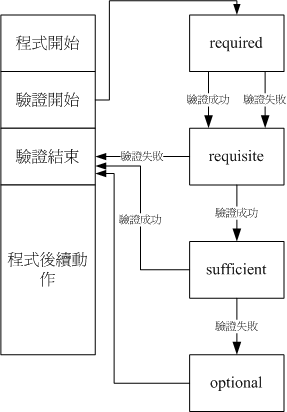

<!-- TOC -->

- [14.5 用户的特殊 shell 与 PAM 模块](#145-用户的特殊-shell-与-pam-模块)
    - [14.5.3 PAM 模块设置语法](#1453-pam-模块设置语法)
    - [14.5.4 常用模块简介](#1454-常用模块简介)
    - [14.5.5 其他相关文件](#1455-其他相关文件)

<!-- /TOC -->

# 14.5 用户的特殊 shell 与 PAM 模块

## 14.5.3 PAM 模块设置语法

PAM 调用流程：

1. 用户开始执行 `/usr/bin/passwd` 命令，并输入密码；
2. `passwd` 呼叫 PAM 模块进行验证；
3. PAM 模块会到 `/etc/pam.d/` 找寻与程序 (passwd) 同名的配置文件；
4. 依据 `/etc/pam.d/passwd` 内的设定，引用相关的 PAM 模块逐步进行验证分析；
5. 将验证结果 (成功、失败以及其他讯息) 回传给 passwd 这支程序；
6. passwd 这支程序会根据 PAM 回传的结果决定下一个动作 (重新输入新密码或者通过验证！)

```
[root@www ~]# cat /etc/pam.d/passwd
#%PAM-1.0  <==PAM版本的说明而已！
auth       include      system-auth <==每一行都是一个验证的过程
account    include      system-auth
password   include      system-auth
验证类别   控制标准     PAM 模块与该模块的参数
```

**第一个字段：验证类别 (Type)**

验证类别主要分为四种，分别说明如下：

* auth <br>
是 authentication (认证) 的缩写，所以这种类别主要用来检验使用者的身份验证，这种类别通常是需要口令来检验的， 所以后续接的模块是用来检验用户的身份。

* account <br>
account (账号) 则大部分是在进行 authorization (授权)，这种类别则主要在检验使用者是否具有正确的权限， 举例来说，当你使用一个过期的口令来登陆时，当然就无法正确的登陆了。

* session <br>
session 是会议期间的意思，所以 session 管理的就是使用者在这次登陆 (或使用这个命令) 期间，PAM 所给予的环境配置。 这个类别通常用在记录用户登陆与注销时的信息！例如，如果你常常使用 su 或者是 sudo 命令的话， 那么应该可以在 /var/log/secure 里面发现很多关于 pam 的说明，而且记载的数据是『session open, session close』的信息！ 

* password <br>
password 就是口令嘛！所以这种类别主要在提供验证的修订工作，举例来说，就是修改/变更口令啦！

这四个验证的类型通常是有顺序的，不过也有例外就是了。 会有顺序的原因是，(1)我们总是得要先验证身份 (auth) 后， (2)系统才能够藉由用户的身份给予适当的授权与权限配置 (account)，而且(3)登陆与注销期间的环境才需要配置， 也才需要记录登陆与注销的信息 (session)。如果在运行期间需要口令修订时，(4)才给予 password 的类别。

**第二个字段：验证的控制旗标 (control flag)**

这个字段在管控该验证的放行方式，主要也分为四种控制方式：

* required
此验证若成功则带有 success (成功) 的标志，若失败则带有 failure 的标志，但不论成功或失败都会继续后续的验证流程。 由于后续的验证流程可以继续进行，因此相当有利于数据的登录 (log) ，这也是 PAM 最常使用 required 的原因。

* requisite
若验证失败则立刻回报原程序 failure 的标志，并终止后续的验证流程。若验证成功则带有 success 的标志并继续后续的验证流程。 这个项目与 required 最大的差异，就在于失败的时候还要不要继续验证下去？由于 requisite 是失败就终止， 因此失败时所产生的 PAM 信息就无法透过后续的模块来记录了。

* sufficient
若验证成功则立刻回传 success 给原程序，并终止后续的验证流程；若验证失败则带有 failure 标志并继续后续的验证流程。 这玩意儿与 requisits 刚好相反！

* optional
这个模块控件目大多是在显示信息而已，并不是用在验证方面的。



## 14.5.4 常用模块简介

* `/etc/pam.d/*`：每个程序个别的 PAM 配置文件；
* `/lib/security/*`：PAM 模块文件的实际放置目录；
* `/etc/security/*`：其他 PAM 环境的配置文件；
* `/usr/share/doc/pam-*/`：详细的 PAM 说明文件。

**pam_securetty.so**

限制系统管理员 (root) 只能够从安全的 (secure) 终端机登陆；安全终端机写在 `/etc/securetty` 这个文件中。所以 root 可以从 tty1~tty7 登陆，但却无法透过 telnet 登陆 Linux 主机了！

**pam_nologin.so**

这个模块可以限制一般用户是否能够登陆主机之用。当 `/etc/nologin` 这个文件存在时，则所有一般使用者均无法再登陆系统了！若 `/etc/nologin` 存在，则一般使用者在登陆时， 在他们的终端机上会将该文件的内容显示出来！所以，正常的情况下，这个文件应该是不能存在系统中的。 但这个模块对 root 以及已经登陆系统中的一般账号并没有影响。

**pam_selinux.so**

SELinux 是个针对程序来进行细部管理权限的功能。由于 SELinux 会影响到用户运行程序的权限，因此我们利用 PAM 模块，将 SELinux 暂时关闭，等到验证通过后， 再予以启动！

**pam_console.so**

当系统出现某些问题，或者是某些时刻你需要使用特殊的终端接口 (例如 RS232 之类的终端联机设备) 登陆主机时， 这个模块可以帮助处理一些文件权限的问题，让使用者可以透过特殊终端接口 (console) 顺利的登陆系统。

**pam_loginuid.so**

系统账号与一般账号的 UID 是不同的！一般账号 UID 均大于 500 才合理。 因此，为了验证使用者的 UID 真的是我们所需要的数值，可以使用这个模块来进行规范！

**pam_env.so**

用来配置环境变量的一个模块，如果你有需要额外的环境变量配置，可以参考 `/etc/security/pam_env.conf` 这个文件的详细说明。

**pam_unix.so**

这是个很复杂且重要的模块，这个模块可以用在验证阶段的认证功能，可以用在授权阶段的账号许可证管理， 可以用在会议阶段的登录文件记录等，甚至也可以用在口令升级阶段的检验!

**pam_cracklib.so**

可以用来检验口令的强度！包括口令是否在字典中，口令输入几次都失败就断掉此次联机等功能，都是这模块提供的！

**pam_limits.so**

`ulimit` 其实那就是这个模块提供的能力！还有更多细部的配置可以参考： /etc/security/limits.conf 内的说明。

login 的 PAM 验证机制流程：

1. 验证阶段 (auth)：首先，(a)会先经过 pam_securetty.so 判断，如果使用者是 root 时，则会参考 /etc/securetty 的配置； 接下来(b)经过 pam_env.so 配置额外的环境变量；再(c)透过 pam_unix.so 检验口令，若通过则回报 login 程序；若不通过则(d)继续往下以 pam_succeed_if.so 判断 UID 是否大于 500 ，若小于 500则回报失败，否则再往下 (e)以 pam_deny.so 拒绝联机。

2. 授权阶段 (account)：(a)先以 pam_nologin.so 判断 /etc/nologin 是否存在，若存在则不许一般使用者登陆； (b)接下来以 pam_unix 进行账号管理，再以 (c) pam_succeed_if.so 判断 UID 是否小于 500 ，若小于 500 则不记录登录信息。(d)最后以 pam_permit.so 允许该账号登陆。

3. 口令阶段 (password)：(a)先以 pam_cracklib.so 配置口令仅能尝试错误 3 次；(b)接下来以 pam_unix.so 透过 md5, shadow 等功能进行口令检验，若通过则回报 login 程序，若不通过则 (c)以 pam_deny.so 拒绝登陆。

4. 会议阶段 (session)：(a)先以 pam_selinux.so 暂时关闭 SELinux；(b)使用 pam_limits.so 配置好用户能够操作的系统资源； (c)登陆成功后开始记录相关信息在登录文件中； (d)以 pam_loginuid.so 规范不同的 UID 权限；(e)开启 pam_selinux.so 的功能。

## 14.5.5 其他相关文件

**limits.conf**

```
范例一：vbird1 这个用户只能创建 100MB 的文件，且大于 90MB 会警告
[root@www ~]# vi /etc/security/limits.conf
vbird1	soft		fsize		 90000
vbird1	hard		fsize		100000
#账号   限制依据	限制项目 	限制值

# 第一字段为账号，或者是群组！若为群组则前面需要加上 @ ，例如 @projecta
# 第二字段为限制的依据，是严格(hard)，还是仅为警告(soft)；
# 第三字段为相关限制，此例中限制文件容量，
# 第四字段为限制的值，在此例中单位为 KB。
# 若以 vbird1 登陆后，进行如下的操作则会有相关的限制出现！

[vbird1@www ~]$ ulimit -a
....(前面省略)....
file size               (blocks, -f) 90000
....(后面省略)....

[vbird1@www ~]$ dd if=/dev/zero of=test bs=1M count=110
File size limit exceeded
[vbird1@www ~]$ ll -k test
-rw-rw-r-- 1 vbird1 vbird1 90000 Mar  4 11:30 test
# 果然有限制到了

范例二：限制 pro1 这个群组，每次仅能有一个用户登陆系统 (maxlogins)
[root@www ~]# vi /etc/security/limits.conf
@pro1   hard   maxlogins   1
# 如果要使用群组功能的话，这个功能似乎对初始群组才有效喔！
# 而如果你尝试多个 pro1 的登陆时，第二个以后就无法登陆了。
# 而且在 /var/log/secure 文件中还会出现如下的信息：
# pam_limits(login:session): Too many logins (max 1) for pro1
```

**`/var/log/secure`, `/var/log/messages`**

由于 PAM 模块都会将数据记载在 /var/log/secure 当中，所以发生了问题请务必到该文件内去查询一下问题点！

